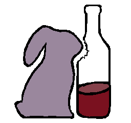

# Rabbit Wine

Welcome to **Rabbit Wine**!  
This is a web app for working with sticker packs: you can browse, customize, and export stickers.  
The interface is designed to be straightforward and easy to use.

You can host the app on your own or use our free hosted version at [rabbit.wine]("http://rabbit.wine")

---

## Features

- Browse and switch between sticker packs (add your own if needed).
- Adjust sticker options such as type, size, background, and flip.
- Preview stickers and copy or download them.
- Settings are saved in your browser.
- Usable on both desktop and mobile devices.

Features and options may change as the project evolves.  
If you encounter issues or have suggestions, feel free to open an issue or fork the project.

---

## Adding Sticker Packs

Add a folder with a `config.json` and sticker images to the project, then use the "Add" button in the app to load it.  
If the configuration is valid, the pack will appear in the app. For errors, check the browser console.

---

## License

This project is licensed under the Digital Lifeform License.  
See [LICENSE](LICENSE) for details.

---

🐰🍷 by Arfyvex Research Labs
